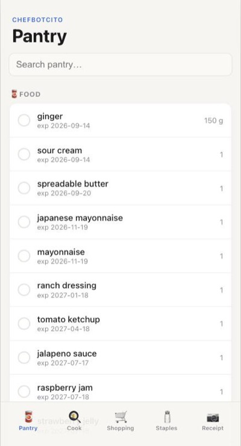
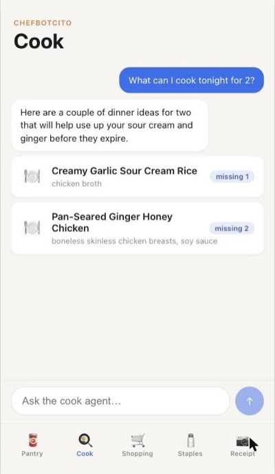
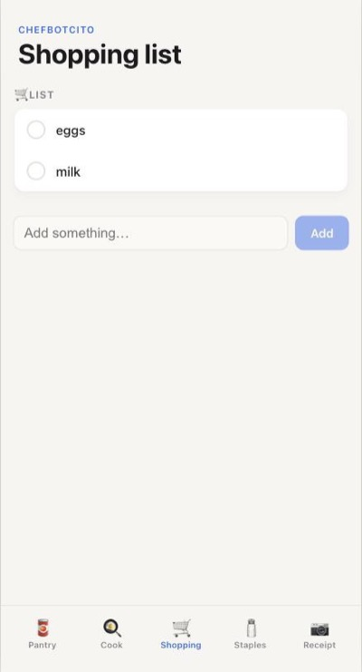
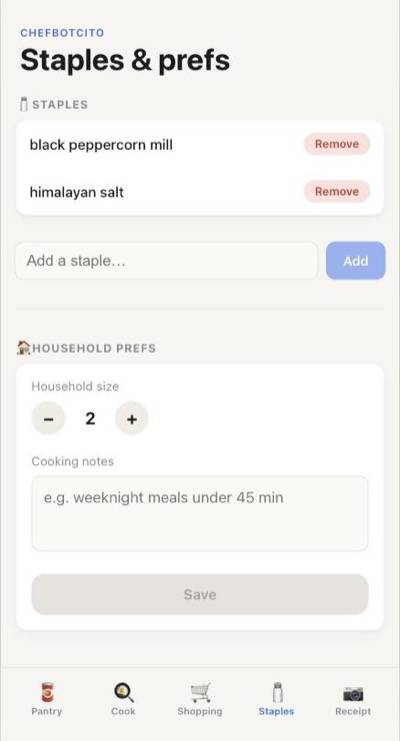

# Chefbotcito

A household food + pantry inventory tracker for two users, built around Tesco Ireland receipt photos. Snap a receipt in the Chefbotcito web app, confirm the parse, and it tracks what's in the house, nudges you before food expires, suggests what to cook, and keeps a shopping list in sync.

## Screenshots

<table>
  <tr>
    <td align="center"></td>
    <td align="center"></td>
    <td align="center"></td>
    <td align="center"></td>
  </tr>
  <tr>
    <td align="center"><b>Pantry</b><br>what's in stock, soonest to expire first</td>
    <td align="center"><b>Cook</b><br>asks the agent, gets dishes built from what's on hand</td>
    <td align="center"><b>Shopping</b><br>the list, plus Cycle Guesses and use-soon nudges</td>
    <td align="center"><b>Staples</b><br>always-assumed-present items and cooking prefs</td>
  </tr>
</table>

Installed to the home screen as a PWA; every screen is built for one-handed phone use.

## What it does

- **Receipt-photo ingestion** — upload a photo of a Tesco receipt and Gemini extracts line items into Products and Stock Lots. Known raw receipt strings (e.g. `T.FIN B/BEANS 420G`) are remembered permanently, so the same product never needs re-parsing.
- **Inventory tracking** — the Pantry screen lists everything in stock, soonest-expiring food first, each with a one-tap Finish button. Stock only ever changes on a human tap — nothing auto-expires or auto-finishes.
- **Expiry Digest** — a section of the Pantry screen, computed fresh on every load, listing what's expiring within 2 days and what just expired, with Gone / Still-good buttons to resolve each.
- **Shopping list** — the Shopping screen shows what's queued, plus "probably low" Cycle Guesses derived from purchase history and "use soon" nudges from lots close to expiry.
- **Recipe suggestions** — the Cook screen surfaces favorite recipes fully covered by what's on hand, then asks Gemini for more, split into "cook tonight" (nothing missing) and "almost there" (a few items away, one tap to queue them).
- **Chat** — a free-form agent chat pane for anything that doesn't fit a dedicated screen (adding items in plain English, asking questions about stock), backed by the same Brain/tool-calling seam as receipts and recipes.
- **Staples & Auto-Relist** — mark products that are always assumed present (Staples screen) or that should re-queue themselves the moment they're finished, no prompt needed.
- **Preferences** — the Staples & Prefs screen holds household size and a free-text cooking-constraints blurb that shapes recipe suggestions.

## Why it exists

Built for a two-person household to replace mental tracking of "do we still have X" and "what's about to go off." Design decisions are recorded as ADRs in [`docs/adr/`](docs/adr/); the domain vocabulary (Product, Stock Lot, Raw Name, Cycle Guess, etc.) is defined in [`CONTEXT.md`](CONTEXT.md).

Three decisions shape everything else:

- **Product vs. Stock Lot** ([ADR 0001](docs/adr/0001-product-stock-lot-split.md)) — catalog identity (name, category, staple flag) is split from purchase state (quantity, purchase date, expiry, status), so recipes/shopping reason about Products while expiry/finish/decrement reason about Lots.
- **Human-confirmed state only** ([ADR 0002](docs/adr/0002-human-confirmed-state-only.md)) — estimated expiry, "probably low," and decremented quantities are all derived at query time. Nothing about stored state changes without a one-tap human confirmation; no cron job silently flips a status.
- **Single Pi container** ([ADR 0003](docs/adr/0003-deploy-on-household-pi.md)) — this serves one household, so it runs as a single Docker container on a household Raspberry Pi, fronted by a named Cloudflare Tunnel. No inbound ports opened on the host, no reverse proxy config to maintain.

## Access

There's no username/password login. Each household member gets a one-time bootstrap link (`pnpm mint-token <name>`, run on the Pi) that sets a long-lived cookie the first time they open it; every other route is gated on that cookie. See [ADR 0003](docs/adr/0003-deploy-on-household-pi.md) for why this fits a two-person household better than a full auth stack.

## Architecture

- **Runtime**: Node 22 + TypeScript, [Astro](https://astro.build/) (server output, `@astrojs/node` standalone adapter) + [Preact](https://preactjs.com/) islands for the UI, [better-sqlite3](https://github.com/WiseLibs/better-sqlite3) + [Drizzle ORM](https://orm.drizzle.team/) for storage.
- **Brain seam** ([`src/brain.ts`](src/brain.ts)): a single Zod-validated interface (`extractReceipt`, `reviseReceipt`, `suggestRecipes`, `estimateShelfLife`, `parseFreeTextItems`, `reviseFreeTextItems`, `converse`) that every LLM-touching flow goes through. [`src/brain/gemini.ts`](src/brain/gemini.ts) is the default real implementation (Gemini, paid tier — the free tier's 20 requests/day/model is too low for real usage), with JSON-only prompts, one retry on parse failure, and exponential backoff before raising `BrainUnavailableError` (surfaced to users as "🧠 busy, try again in a minute"). [`src/brain/groq.ts`](src/brain/groq.ts) is a working alternative implementation, not currently wired up — its free-tier per-request token budget (8K TPM on `qwen/qwen3.6-27b`) proved too tight for image + reasoning + structured JSON output together. Shelf-life estimation first consults the free USDA FoodKeeper dataset before falling back to the Brain. [`src/brain/fake.ts`](src/brain/fake.ts) is a canned-response fake, toggled by `FAKE_BRAIN=1`, for dev/testing without burning API quota.
- **Data model** ([`src/db/schema.ts`](src/db/schema.ts)): `products` (catalog identity), `stock_lots` (one purchase, `in_stock`/`finished`), `shopping_list_entries`, `raw_name_map` (permanent receipt-string → product), `prefs`, `pendings`, `recipes` (rating history), `person_tokens` (bootstrap-cookie auth). The Expiry Digest has no table of its own — it's derived at query time from `stock_lots` (#47).
- **Ops**: an in-process heartbeat file backs a Docker `HEALTHCHECK`; a nightly cron `VACUUM INTO`s a snapshot file onto the host filesystem for the existing backup routine to pick up. Both are registered by [`src/webServer.ts`](src/webServer.ts) at process startup and log-and-continue on failure rather than crashing the server.

```
src/
  brain.ts             LLM seam interface
  brain/gemini.ts, brain/fake.ts
  db.ts, db/schema.ts
  add.ts, cook.ts, cookAgent.ts, digest.ts, finish.ts, inventory.ts,
  list.ts, prefs.ts, receipt.ts, reconcile.ts, shopping.ts, staple.ts
  personTokens.ts      bootstrap-cookie auth
  config.ts            env var loading/validation
  healthcheck.ts, heartbeat.ts, snapshot.ts   ops
  webServer.ts         production entrypoint (ops wiring + Astro server)
  scripts/mint-token.ts

web/
  src/pages/           index (Pantry), shopping, cook, staples, receipt, bootstrap/[token]
  src/components/      Preact islands
  src/actions/         Astro Actions — the write side, calling straight into src/*.ts
  src/middleware.ts     bootstrap-cookie gate
  src/lib/webDb.ts      request-scoped Config/Db/Brain singletons
```

## Getting started

### Prerequisites

- Node ≥22, [pnpm](https://pnpm.io/) 10
- A Gemini API key

### Setup

```bash
pnpm install
cp .env.example .env   # fill in the values below
pnpm dev                # astro dev, runs against a local SQLite file
```

`.env`:

| Var | Required | Default | Notes |
|---|---|---|---|
| `GEMINI_API_KEY` | yes | — | tried first; can be a free-tier key — once it fails (e.g. daily quota), the Brain falls back to `GEMINI_API_KEY_PAID` if set |
| `GEMINI_API_KEY_PAID` | no | — | billed key (Google Cloud Console) used as a fallback once `GEMINI_API_KEY` fails |
| `TZ` | yes | — | e.g. `Europe/Dublin`; governs snapshot cron timing |
| `WEB_APP_URL` | yes | — | public URL used to build bootstrap links (`pnpm mint-token`) |
| `DB_PATH` | no | `pantry.db` | |
| `HEARTBEAT_PATH` | no | `heartbeat` | |
| `HEARTBEAT_INTERVAL_MS` | no | `30000` | |
| `HEARTBEAT_STALE_MS` | no | `90000` | healthcheck fails if the heartbeat file is older than this |
| `SNAPSHOT_PATH` | no | `pantry.snapshot.db` | |
| `SNAPSHOT_CRON` | no | `0 3 * * *` | |
| `CLOUDFLARE_TUNNEL_TOKEN` | deploy only | — | named tunnel token, from the Zero Trust dashboard |
| `FAKE_BRAIN` | no | — | set to `1` to use canned Brain responses instead of calling Gemini |

### Scripts

```bash
pnpm dev          # astro dev, hot reload
pnpm build        # compile src/ to dist/ (ops entrypoint + healthcheck, for deploy)
pnpm start        # run dist/webServer.js (production entrypoint)
pnpm web:build    # astro build, produces web/dist/
pnpm web:check    # astro check
pnpm mint-token <name>   # mint or rotate a household member's bootstrap link
pnpm test         # vitest run
pnpm test:watch
pnpm typecheck
pnpm lint         # biome check
pnpm lint:fix
```

Tests live in `test/`, one file per module (plus `test/web/` for the Astro Actions/middleware layer, and `test/support/` for shared fakes: a fake `Brain`, a fake clock). Pre-commit hooks run via lefthook (installed automatically on `pnpm install`).

### Deploying

Ships as a single Docker container (arm64) via `docker-compose.yml`, designed for OMV's Compose plugin on a household Raspberry Pi — see [ADR 0003](docs/adr/0003-deploy-on-household-pi.md). A named Cloudflare Tunnel (`cloudflared`, same compose stack) fronts it with a CA-signed HTTPS URL; no ports are exposed on the host. The bind-mounted `/data` volume holds the SQLite DB, heartbeat file, and nightly snapshot so the host's existing backup routine can see them directly.

```bash
docker compose up -d
```

## Project docs

- [`CONTEXT.md`](CONTEXT.md) — domain vocabulary
- [`docs/adr/`](docs/adr/) — architecture decisions
- [`docs/agents/`](docs/agents/) — issue tracker, triage labels, and domain-doc conventions for agents working in this repo
- [`docs/research/prior-art-pantry-apps.md`](docs/research/prior-art-pantry-apps.md) — build-vs-reuse research behind the build-from-scratch decision

## Status

Chefbotcito started as a Telegram bot (issue #1), then rebuilt as a standalone web app once the Mini App work (#19–#48) showed the web UI could cover everything the bot did; the bot was deleted in #51 and the deploy consolidated to one process in #52.
